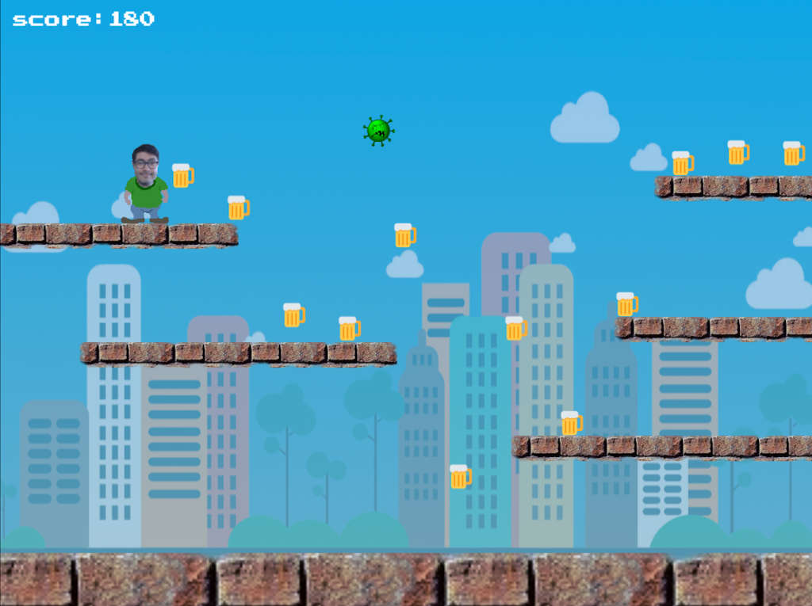

# Pestana World

Imagine that it is raining beer and at the same time a new virus starts to infect the town where you live. That is your mission in this game: drink as much beer as you can and run away from this terrible virus that can kill.

**[Play now](https://andrepestana.github.io/pestana-world/)**

## Usage

-   `npm start` to run dev-server at localhost:8080.
-   `npm run watch` to only watch for/recompile on changes.
-   `npm run build` to generate a minified, production-ready build.
